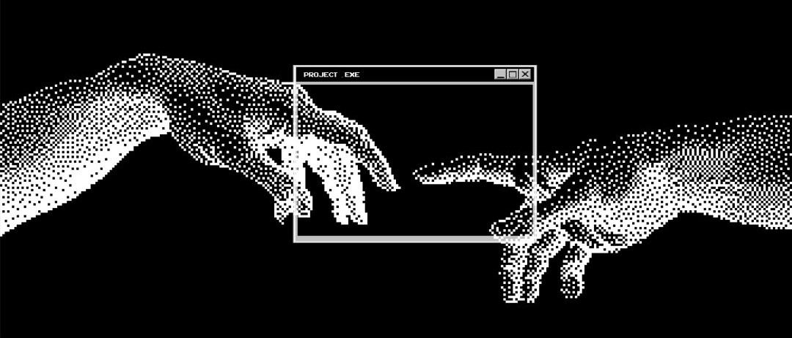

  

## Hi, I'm Kaif 👋

# 💫 About Me:
- 🔭 I’m currently building **production-ready backend APIs with FastAPI** - 👯 I’m open to collaborating on **Python Backend & Open Source projects** - 🤝 Looking for guidance in **System Design, Docker, and Cloud** - 🌱 Currently learning **PostgreSQL, SQLAlchemy, Authentication (JWT), and Redis** - 💬 Ask me about **Python, FastAPI, SQL, Git, GitHub, and DSA** - ⚡ Fun fact: **Clean code > Clever code.**

## 🌐 Socials:
  

## 💻Tech Stack:

  
  
  
  
  
  
  
  
  
  
  

###

  
  
  
  
  
  
  
  
  
  
  

###

  
  
  
  
  
  
  
  
  

###
# 📊 GitHub Stats:
 
 

## 🏆 GitHub Trophies

## 👾 Pac-Man Contribution Graph

<picture>
  <source media="(prefers-color-scheme: dark)"
    srcset="https://raw.githubusercontent.com/midnightshady/midnightshady/output/pacman-contribution-graph-dark.svg">

  <source media="(prefers-color-scheme: light)"
    srcset="https://raw.githubusercontent.com/midnightshady/midnightshady/output/pacman-contribution-graph.svg">

  
</picture>

### ✍️ Random Dev Quote

### 🔝 Top Contributed Repo

---

<!-- Proudly created with GPRM ( https://gprm.itsvg.in ) -->
